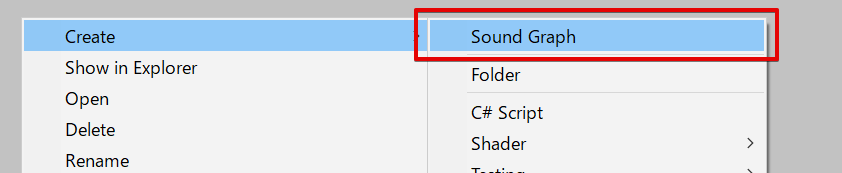
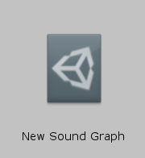
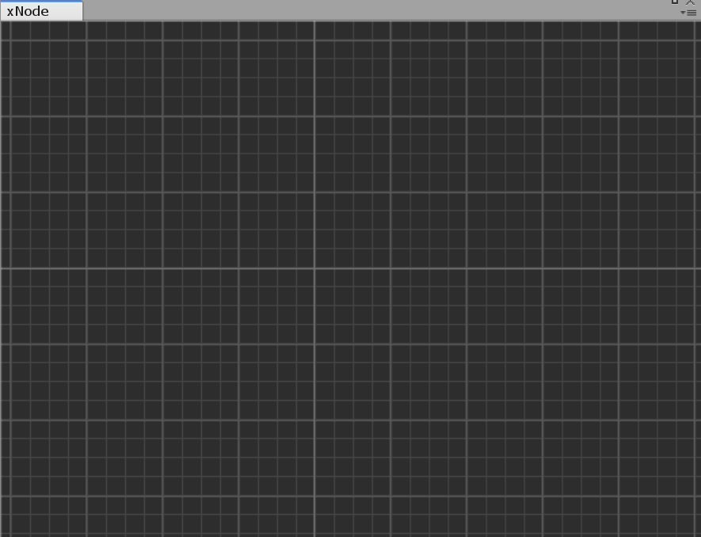
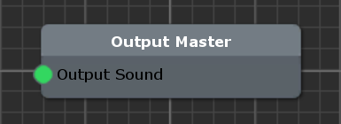
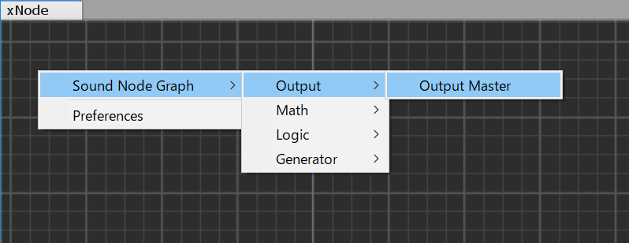
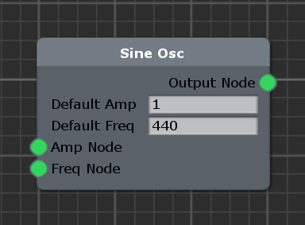
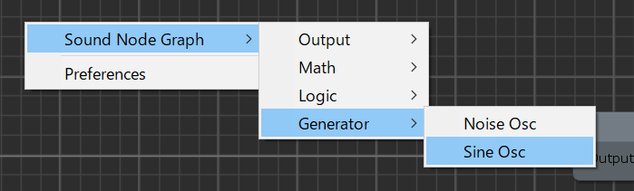
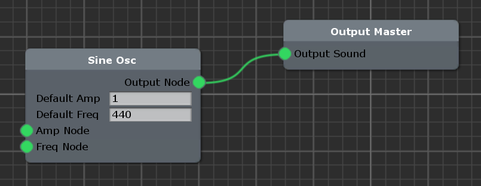
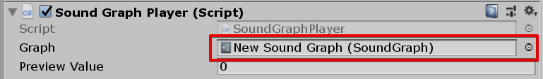

# Unity-NodeSynthesizer
Nose-Based Synthesizer on UnityEditor, based on xNode. 

GitHub - Siccity/xNode: Lets you view and edit node graphs inside Unity 
https://github.com/Siccity/xNode

# Unity Version
Unity 2018.3.0f1 

# Usage
## Create SoundGraph
Right click on Project window,  
select **Create/SoundGraph**.  

 

The following is a **SoundGraph** asset. 
 

## Open SoundGraph
To open SoundGraph asset, double click SoundGraph asset. 

Double clicking SoundGraph asset will open xNode Window. 
 

## Create Sound
To create sound, you must create Oscillator and Output Node. 

### Create OutputNode
Output Master node output sound to speaker. 

 

Right click and *select* **Sound Node Graph > Output > Output Master** 

### Create Oscillator Node
**Sine Osc** node generates sine wave. 
 

Right click and *select* **Sound Node Graph > Generator > Sine Osc** 

 

### Output Sound
Connect Sine OSC node and Output Master node. 
 

## PlaySound
Add SoundGraphPlayer component to GameObject. 
Assign SoundGraph asset to SoundGraphPlayer. 
 
 
Sound will be played at run time. 

